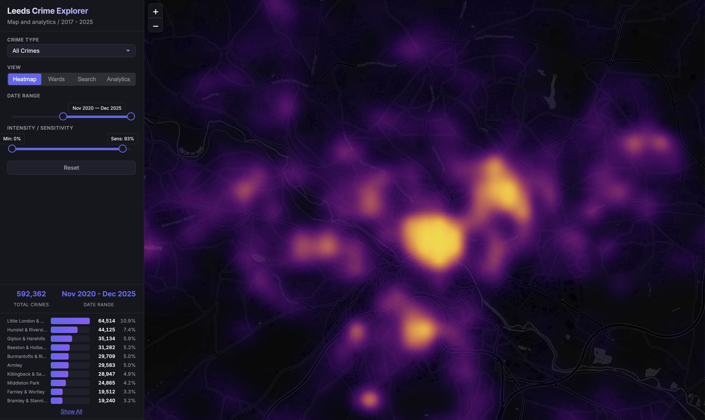
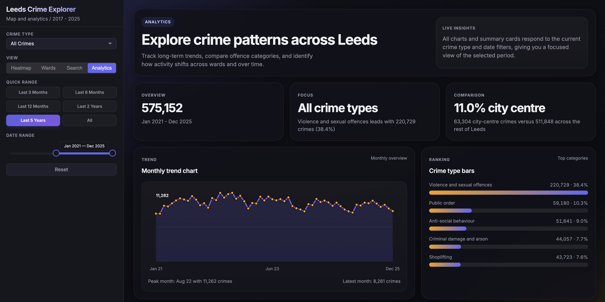
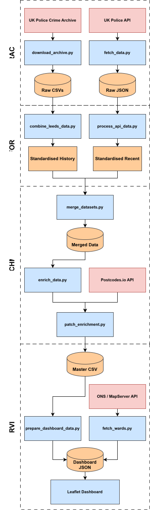

# Leeds Crime Intelligence Platform


[](https://christian-camille.github.io/leeds-crime-data/)
[](https://github.com/christian-camille/leeds-crime-data/actions)

A comprehensive geospatial intelligence platform for the Leeds metropolitan area. This project combines a robust ETL pipeline with an interactive web dashboard to visualise over **1,000,000 crime records** spanning **2017–2025**. You can explore the data interactively on the [Live Dashboard](https://christian-camille.github.io/leeds-crime-data/). It integrates data from the **UK Police API**, **Leeds City Council**, and **ONS**, providing hyper-local insights through heatmaps, ward-level choropleths, postcode-radius search, and a dedicated analytics workspace for trend and seasonality analysis.

<p align="center">
  
  <br>
  <span style="font-size: 16px; font-weight: bold;">Crime Heat Map</span>
</p>

## Project Highlights

- **Interactive Dashboard**: A responsive web application with four modes: Heatmap, Ward Choropleth, Postcode Search, and a dedicated Analytics view.
- **Analytics Workbench**: Filter-responsive KPI cards, monthly trend charts, crime-type rankings, seasonal heatmaps, and sortable ward comparisons for deeper exploration beyond the map.
- **Postcode Radius Search**: Static postcode lookup with an adjustable **100m to 1km** radius, aggregated local crime totals, and crime-type breakdowns.
- **Robust ETL Pipeline**: Automated ingestion system that handles incremental updates, rate limiting, and historical data merging.
- **Geospatial Intelligence**: Precise point-in-polygon validation (`Shapely`) and batch geocoding (`postcodes.io`) to enrich every crime record with administrative boundaries.
- **Data Normalisation**: Unified schema across disparate sources (API vs Archive) to ensure consistent categorisation and analysis.
- **Optimised Performance**: Pre-aggregated data structures (`JSON`) to ensure sub-second rendering of over one million data points in the browser.

<p align="center">
  
  <br>
  <span style="font-size: 16px; font-weight: bold;">Analytics Workbench</span>
</p>

## Data Pipeline

<p align="center">
  
  
</p>


## Dataset Features

| Feature | Description |
|---------|-------------|
| Crime ID | Unique identifier for each crime record |
| Month | Date of the crime (YYYY-MM) |
| Location | Street-level location with coordinates |
| Crime Type | Normalised category (e.g., "Violence and sexual offences") |
| LSOA | Lower Super Output Area code and name |
| Ward Name | Electoral ward (e.g., "Little London & Woodhouse") |
| Postcode District | First part of postcode (e.g., "LS1") |
| Polling District | Voting district code (e.g., "LWE") |
| Outcome | Case outcome where available |


## Tech Stack

- **Python 3.12** - Core ETL logic
- **Pandas & NumPy** - High-performance data manipulation
- **Shapely** - Geospatial operations and polygon validation
- **Requests** - Robust API integration
- **Pytest** - Automated testing suite


## Installation

### Prerequisites
- Python 3.12+
- pip
- Git

### Setup

```bash
# Clone the repository
git clone https://github.com/christian-camille/leeds-crime-data.git
cd leeds-crime-data

# Create virtual environment (recommended)
python -m venv venv
source venv/bin/activate  # On Windows: venv\Scripts\activate

# Install dependencies
pip install -r requirements.txt

```

## Usage

The pipeline is orchestrated via a central script, but individual components can be run independently for debugging or partial updates.

### Quick Run (Full Pipeline)

This is the recommended way to execute the entire workflow from extraction to enrichment.

```bash
python src/main.py

```

### Manual Step-by-Step Execution

If you prefer to run the stages manually:

**0. Download Historical Data** Downloads archived crime data from Police.uk (required for historical analysis). For full history, request coverage from Jan-2017 using compact mode (minimum snapshot archives whose contents reach back to that month).

```bash
python src/download_archives.py --cover-since 2017-01

```

Optional (slower, more redundant downloads):

```bash
python src/download_archives.py --cover-since 2017-01 --all-months

```

**1. Generate Archive Data** Aggregates historical data from local archive files (auto-discovers available months from `data/archive` folders or `YYYY-MM.zip` archives, extracts ZIPs on demand, then removes extracted ZIP files).

```bash
python src/combine_leeds_data.py

```

**2. Fetch API Data** Fetches incremental "fresh" data from the UK Police API (months not covered by archive snapshots).

```bash
python src/main.py --step 2

```

The API fetcher now checkpoints progress per month in `data/raw/.fetch_state`, retries transient network failures automatically, and can resume interrupted months without restarting the whole grid scan.

To check whether any checkpoint-tracked months currently need repair, run:

```bash
python src/fetch_data.py --detect-repair-needed

```

This detector is read-only and reports only months with tracked failed grid points in `data/raw/.fetch_state`. It does not infer gaps from older completed CSVs that were created before failed-point tracking existed.

To repair already fetched months and recover records from missing grid points, run:

```bash
python src/fetch_data.py --start 2022-11 --end 2026-03 --repair-existing

```

**3. Process & Filter** Normalises API data and performs geospatial filtering.

```bash
python src/process_api_data.py

```

**4. Merge & Enrich** Consolidates all sources and appends Ward/Postcode/Polling District metadata.

```bash
python src/merge_datasets.py
python src/enrich_data.py

```

**5. Fetch Boundaries** Retrieves and processes official Leeds ward boundaries for the map.

```bash
python src/fetch_wards.py

```

**6. Prepare Dashboard** Transforms the processed CSV into optimised JSON for the web interface.

```bash
python src/prepare_dashboard_data.py

```

## Interactive Dashboard

The dashboard is the centrepiece of this project, offering a high-performance interface for exploring 7+ years of crime data. Built with **Leaflet.js** and **noUiSlider**, it combines interactive mapping with a dedicated analytics workbench, allowing you to move from spatial exploration into trend and comparison analysis without leaving the browser.

### Features
* **Four dashboard modes**: Switch between **Heatmap**, **Wards**, **Search**, and **Analytics** views depending on whether you want spatial context or analytical detail.
* **Heatmap Visualisation**: Dynamic density mapping of crime hotspots with adjustable intensity and sensitivity controls.
* **Ward Choropleth**: Compare total crime volumes across Leeds wards, with supporting ward ranking panels and detail modals.
* **Temporal Filtering**: Analyse specific year and month windows using a dual-handle range slider.
* **Category Filtering**: Isolate specific crime types such as Burglary or Violence and sexual offences.
* **Postcode Search**: Search a Leeds postcode, set a **100m to 1km** radius, and view aggregated local totals, top crime type, and a crime breakdown with a map overlay.
* **Quick Analytics Presets**: Jump straight to the last **3 months**, **6 months**, **12 months**, **2 years**, **5 years**, or the full historical range.
* **Analytics Summary Cards**: See total crimes, active filter context, leading crime category, and city-centre share for the selected window.
* **Monthly Trend Chart**: Track how crime levels rise and fall over time, including peak-month and latest-month summaries.
* **Crime Type Ranking Bars**: Compare the top crime categories by absolute volume and percentage share.
* **City Centre vs Outer Leeds Comparison**: Split the filtered total between city-centre activity and the rest of Leeds.
* **Seasonality Matrix**: Identify recurring monthly patterns across the top crime categories with a compact heatmap grid.
* **Sortable Ward Ranking Table**: Rank wards by total crimes, share of citywide crimes, or change in average monthly crime between the first and second half of the selected range.

### Analytics View

The new **Analytics** view turns the dashboard into a lightweight intelligence workbench. All visualisations respond to the same crime-type and date filters, so you can move from a broad citywide overview into more focused questions such as:

* Which offence category dominates the selected period?
* Are current crime levels concentrated in the city centre or spread across outer Leeds?
* Which wards are increasing or cooling off relative to the first half of the selected date range?
* Do certain crime categories show consistent seasonal peaks?

### Running the Dashboard

To avoid CORS issues when loading the data, serve the dashboard using a local web server:

```bash
# Navigate to the dashboard directory
cd dashboard

# Start a local server (Python 3)
python -m http.server 8000
```

Then open your browser to `http://localhost:8000`.

## Project Structure

```
leeds-crimes/
├── data/
│   ├── archive/          # Historical crime data by month
│   ├── raw/              # Raw API responses
│   └── processed/        # Cleaned and enriched datasets
├── src/
│   ├── main.py                 # Pipeline orchestrator
│   ├── download_archives.py    # Archive data downloader
│   ├── fetch_data.py           # API data collection
│   ├── combine_leeds_data.py   # Archive data aggregation
│   ├── process_api_data.py     # API data normalisation
│   ├── merge_datasets.py       # Data consolidation
│   ├── filter_leeds_locations.py # Geospatial filtering
│   ├── assign_lsoa.py          # LSOA assignment
│   ├── enrich_data.py          # Ward/Postcode enrichment
│   ├── patch_enrichment.py     # Enrichment gap-filling
│   ├── fetch_wards.py          # Ward boundary collection
│   └── prepare_dashboard_data.py # Dashboard data generation
├── tests/
│   ├── test_data_sources.py    # API availability tests
│   ├── test_boundary.py        # Leeds polygon validation
│   ├── test_enrichment.py      # Data quality checks
│   ├── test_location.py        # Location validation
│   └── test_dashboard.py       # Dashboard JSON schema validation
├── requirements.txt
└── README.md

```

## Testing

The project includes a comprehensive test suite to ensure data integrity and API stability. Run these before executing the main pipeline:

```bash
# Run all tests
pytest tests/ -v

```

**Test Categories:**

* `test_data_sources`: Verifies all external APIs are accessible and responding, including the UK Police API, ONS ArcGIS, OSM Nominatim, Postcodes.io (both the reverse-geocode GET and the batch POST endpoint used by the pipeline), and the Leeds Council MapServer.
* `test_boundary`: Validates that the Leeds polygon geometry is correctly loaded and classifies known locations inside/outside the boundary.
* `test_enrichment`: Checks that data quality thresholds are met (e.g., < 5% unknown wards, all required columns present, coordinates within Leeds bounds).
* `test_location`: Samples coordinates to confirm they reside within the Leeds district and validates expected postcodes are present.
* `test_dashboard`: Validates the schema and referential integrity of `dashboard/data/crime_data.json` — checks all top-level keys, index ranges, coordinate bounds, and data types across every point. Skips gracefully if the pipeline has not been run yet.

## Data Sources

* **UK Police API** - [data.police.uk](https://data.police.uk/docs/)
* **ONS Geoportal** - LSOA boundary data
* **OpenStreetMap Nominatim** - Leeds administrative boundary
* **Postcodes.io** - Postcode and ward lookup
* **Leeds City Council MapServer** - Polling District boundaries

## Output

The pipeline produces two primary artifacts:
1. **`data/processed/leeds_street_combined.csv`**: The master dataset containing **1,000,000+ records** (covering **Jan 2017 to Dec 2025**) with 100% Ward/Postcode coverage, ideal for deep analysis (EDA) or ML modelling.
2. **`dashboard/data/crime_data.json`**: An optimised, minified structure containing pre-aggregated indices and spatial coordinates, powering the real-time dashboard across map, ward, and analytics views.
3. **`dashboard/data/postcode_search.json`**: A compact search dataset containing exact aggregated crime points for postcode-radius lookups in the static dashboard.

## Postcode Search Notes

The postcode search stays compatible with static hosting. The browser looks up the entered postcode via **postcodes.io**, then filters the local `postcode_search.json` dataset client-side to compute crimes within a configurable **100m to 1km radius**.

- Results are **aggregated only**: total crimes plus a crime-type breakdown for the active dashboard filters.
- The search radius is adjustable in **100m steps**, making it easier to compare immediate street-level activity against a wider local catchment.
- The search currently supports **Leeds postcodes only**.
- The feature depends on `postcodes.io` being reachable from the browser.

## License

This project is open-source and available under the **MIT License**.


- **Crime Data**: Sourced from the [UK Police API](https://data.police.uk/docs/) under the [Open Government Licence v3.0](https://www.nationalarchives.gov.uk/doc/open-government-licence/version/3/).
- **Boundary Data**: Contains OS data © Crown copyright and database right 2024.

